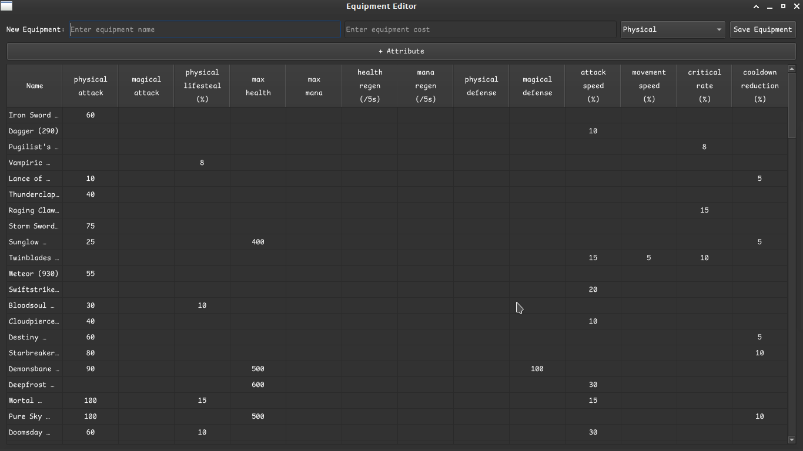

# MOBA Game Equipment Indexer
A Python application built with PyQt6 to collect and manage attributes of MOBA game equipment. All data is stored in JSON format for easy access and backup.

## Feature
- Add equipment information: name, cost, type, and attributes
- View existing equipment in a clear, organized list
- Backup and restore equipment data using JSON files
- Lightweight desktop GUI for quick data management

## Screenshot


## Requirements
- Python 3.11
- Required library
  ```
  PyQt6
  ```
- Optional: Use a virtual environment for dependency management

## Installation
### Clone the repository
```
git clone https://github.com/darwishzain/game-atlas
cd game-atlas/moba
```
### Create virtual environment (optional but recommended)
```
python -m venv venvs
source venvs/bin/activate   #Linux
venvs/Scripts/activate      #Windows
```
### Install dependencies
`pip install -r requirements.txt`

### Running the app
`python main.py`
The GUI window will launch, allowing you to add, view, or manage equipment data.

## Usage
- Add new equipment with attributes like name, cost, type, and stats
- View existing equipment list
- Edit or backup your JSON data for future use

## Project structure

## Data backups
`../data/honorofkings_bkp.json` [JSON](./data/honorofkings_bkp.json)

## Contributing
1. Fork the repository
2. Create a feature branch: `git checkout -b moba-feature/new-feature`
3. Commit your changes: `git commit -m "Add new feature"`
4. Push to branch: `git push origin feature/new-feature`
5. Open a Pull Request